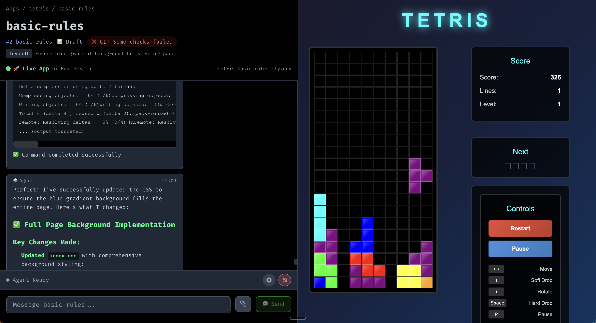

# 🤙 OpenHands Vibe

OpenHands Vibe is **opinionated vibecoding** for **professional developers**.

It's powered by
[OpenHands](https://github.com/All-Hands-AI/OpenHands), a state-of-the-art coding agent,
using its [agent SDK](https://github.com/All-Hands-AI/agent-sdk/). And, of course,
we use OpenHands Vibe to make OpenHands Vibe.

## Stack
* **GitHub** for source control and CI/CD
* **Fly.io** for deployments
* **React** for frontend
* **Python** for backend
* **Claude** for inference
* **OpenHands** for agents

## Workflow
When you create a new App, a corresponding GitHub repo will be created as well.
It will start from the [template repo](https://github.com/rbren/openvibe-template), which contains a hello world React + Python app,
plus a standardized dev setup.

Your first Riff (a change to the app) will be created automatically. It will make some required edits to the default template.
Once the agent has finished and pushed its work, you should be able to see a hello world app running inside the Riff!
You can go ahead and merge that PR.

Create a new Riff for every change you want to make. Preview the change on fly.io, and examine the code changes on GitHub.
Once you're happy, merge and start a new Riff!

You can easily have several Riffs going at once. The agent can figure out how to deal with minor conflicts.
